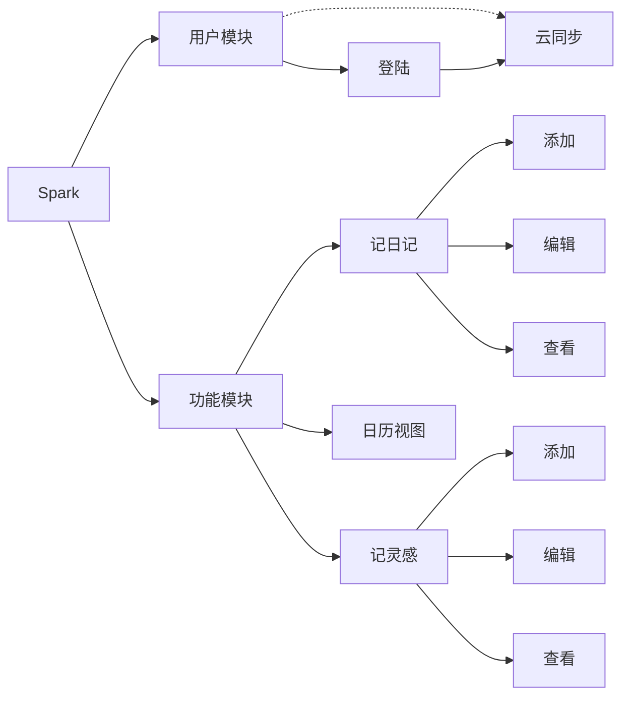

# Spark
不知道大家有没有那种感觉，就是突然有一瞬间内心世界变得异常活跃，大脑的多巴胺促使我们快速浮现出些许绝妙的想法。而这些想法是转瞬即逝的，有时候等我们回过神来，也许就已经忘记了其中关键的细节，只剩下一些潦草的痕迹

Spark，火花，我们的这些想法就像火花，微小脆弱，稍不注意就熄灭不见踪影，但如果我们能够及时的，精心的维护起来，或许能将其慢慢壮大，生出燎原之势

这就涉及到两个方面的问题：

- 如何在大脑迸发灵感的刹那，快速的记录下那点点火花
- 装在瓶中的火花，如何将其一步步培养壮大

小时候有段时间曾迷恋上写日记，或许对于我来说，情感流露于文字之间远比脱口而出来的容易。文字是浪漫的，是确定的，人在每次复述相同的话语时或许会出现变化，而当日的思想情感也常常难以复现，但文字如果在情感迸发的时刻及时的记录下来，就好像一张永不褪色的照片，记录着当时的喜怒哀乐。虽是确定的文字记录了当时确定的灵感，但每每回首，情感却在心中一次次变得深厚。就好比说是情感的输出，那文字就是情感的输入，记录下来的时刻，则让我们在这个并无多少情感来源的世界中提供源源不断的情感输入

所以两部分，一部分需要快速便捷准确的记录那一时刻下的所思所想，另一部分以日记的形式，将自己的情感来壮大那瓶中的火花

或许进去就是三个选择：灵感，思想的火花，情感的涌动

